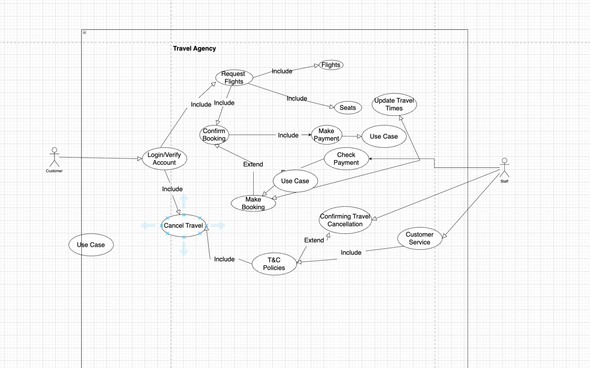
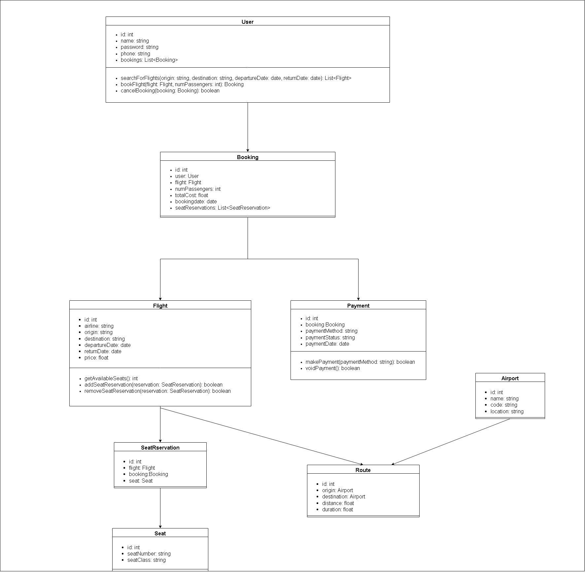
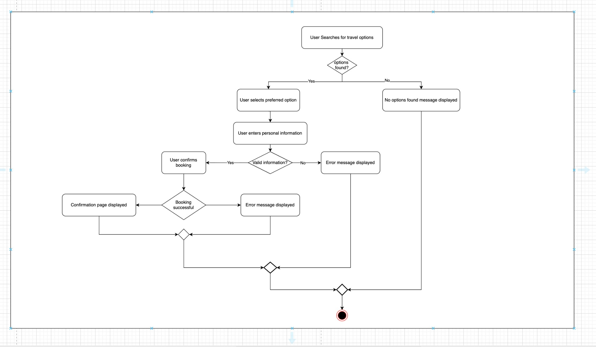
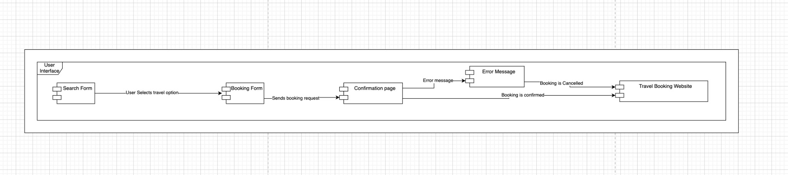

# Software Engineering Labs

Repository for **CS3212 Software Engineering** lab assignments. This repo contains documentation, version control and UML modeling work from the course.

---

## Overview

This repo holds four labs covering:

- **Lab 1** — Code documentation with Doxygen
- **Lab 3** — UML diagrams (Travel Booking), including a use case diagram
- **Lab 4** — Class and sequence diagrams (Travel Booking Website)
- **Lab 5** — Activity, component, and state chart diagrams

> **Note:** Lab 2 (Version control / Git-GitHub) is not included here 

---

## Repository structure

```
Software-Engineering-Labs/
├── README.md
├── docs/
│   └── images/          # Diagram images for README
├── Lab_1/               # Doxygen documentation
│   ├── Own Code/        # Your documented C++ (SumOfTwo.cpp)
│   │   ├── SumOfTwo.cpp
│   │   ├── Doxyfile
│   │   ├── html/        # Generated HTML docs
│   │   └── latex/       # Generated LaTeX docs
│   ├── Sample Code 1/   # Sample header + Doxyfile
│   └── Sample Code 2/   # Doxygen example C++ + Doxyfile
├── Lab_3/               # Travel Booking UML (draw.io, use case diagram)
├── Lab_4/               # Class & sequence diagrams + report
│   ├── Images/          # PNG/PDF exports of diagrams
│   └── *.xml            # Draw.io sources
└── Lab_5/               # Activity, component, state chart diagrams
```

---

## Labs

### Lab 1 — Code documentation (Doxygen)

Introduces **Doxygen** for generating API and project documentation from comments in C++.

- **Own Code:** A small C++ program (`SumOfTwo.cpp`) with a simple `add()` function, fully commented with Doxygen tags (`@file`, `@brief`, `@param`, `@return`, `@page`). Used to generate multi-page HTML and LaTeX docs.
- **Sample Code 1:** Example Doxyfile and a `Time` class in `sample.h` showing file- and class-level Doxygen comments.
- **Sample Code 2:** Full example (`Doxygen_Example.cpp`) with functions, pre/post conditions, and mainpage content.

Run Doxygen from each folder (e.g. `Lab_1/Own Code/`) to regenerate `html/` and `latex/` output.

---

### Lab 3 — UML introduction (Travel Booking)

UML modeling with **draw.io**: a Travel Booking domain diagram stored as `TravelBooking.drawio`, plus a **use case diagram** for a Travel Agency system. The use case diagram defines the main actors (Customer and Staff), the system boundary, and use cases such as Login/Verify Account, Request Flights, Confirm Booking, Make Payment, Cancel Travel, Update Travel Times, Check Payment, and Customer Service, with include and extend relationships.

#### Travel Agency — Use case diagram (Lab 3)



---

### Lab 4 — Class and sequence diagrams (Travel Booking Website)

Focuses on **class diagrams** and **sequence diagrams** for a **Travel Booking Website**:

- **Class diagram** — Main classes, attributes, operations, and relationships.
- **Sequence diagram** — Interaction between objects over time for a booking flow.

Sources are in `Lab_4/` (Draw.io XML); PNG/PDF exports are in `Lab_4/Images/`. Below are the diagram exports used in this README (from `docs/images/`).

#### Class diagram



#### Sequence diagram


---

### Lab 5 — Activity, component, and state chart diagrams

UML **activity**, **component**, and **state chart** diagrams for the travel booking flow:

- **Activity diagram** — Workflow from searching for travel options through selection, entering details, validation, and booking confirmation (with branches for “no options”, invalid information, and booking success/failure).
- **Component diagram** — User-interface flow: Search Form → Booking Form → Confirmation page, with Error Message and Travel Booking Website, showing provided/required interfaces (lollipop/socket notation).
- **State chart diagram** — Booking lifecycle: Details → Payment → Confirmation → Confirmed Booking.

Draw.io sources are in `Lab_5/` (`Activity_Diagram.xml`, `Component_Diagram.xml`, `StateChart_Diagram.xml`). A combined PDF report is in `combinepdf.pdf`.

#### Activity diagram (Lab 5)



#### Component diagram (Lab 5)



#### State diagram (Lab 5)


